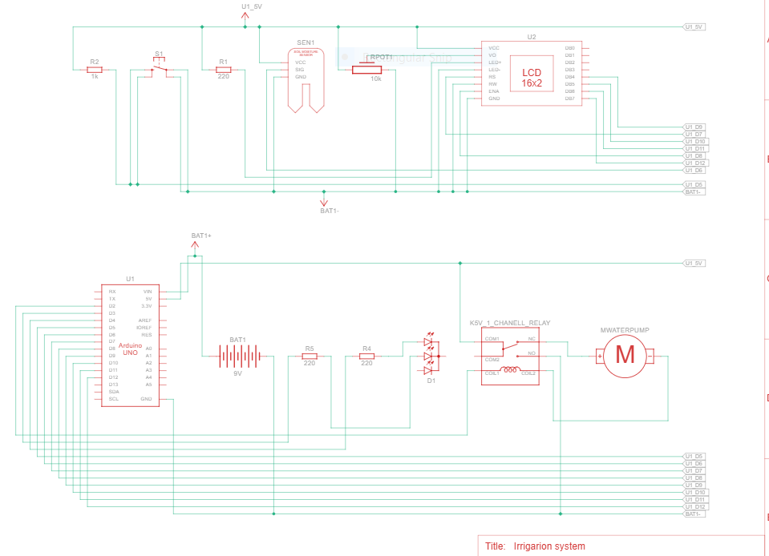
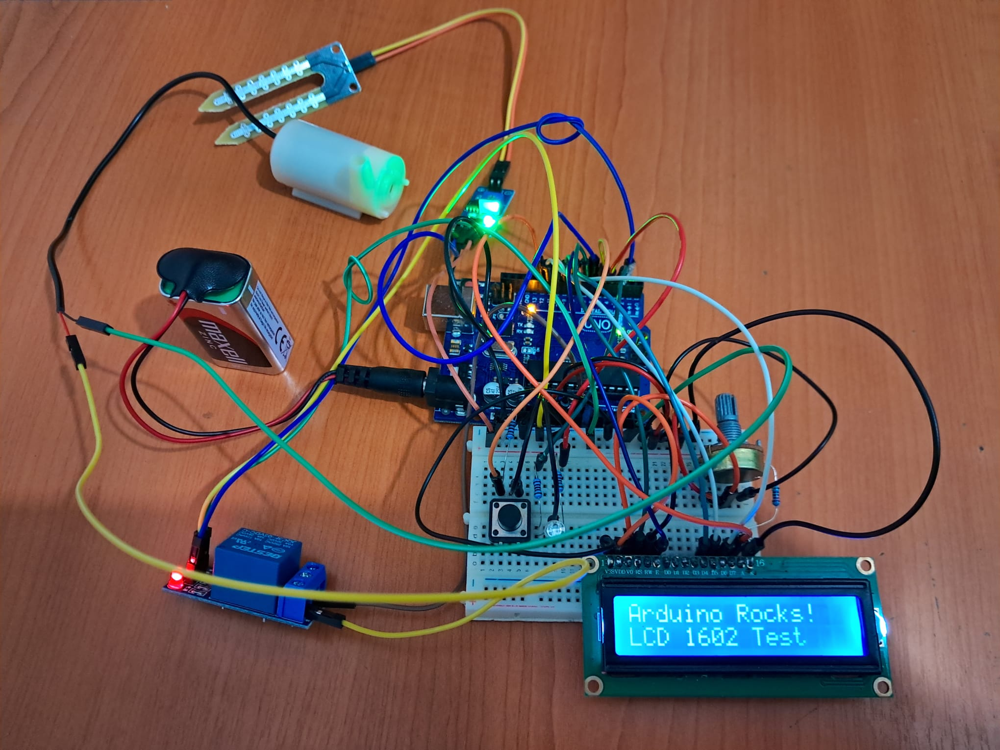

# Automatic-irrigation-system

  ### Introduction
  
Watering plants can be time-consuming and sometimes wasteful. An Automatic Irrigation System solves this problem by watering plants only when they need it. This project uses an Arduino to read data from a soil 
moisture sensor and control a water pump automatically.To make it more interactive, the system includes LEDs to show the status (e.g., dry, watering, or wet), buttons for manual controls, and an LCD to display real-time information like soil moisture levels and system status. This simple yet smart system saves water, helps plants stay healthy, and makes gardening easier and more efficient! 
     
  ### General description
The purpose of this project is the maintenance of a plant or a garden or even a crop, if we were to expand the project, using the arduino-uno microcontroller and its various peripherals.A sensor collects data from the ground, data based on which the microcontroller sends commands through a relay that activates a submersible pump. Through a hose, it pumps water to the ground until the sensor reads a certain level of humidity. This process is automatic but also manual by pressing a button and signaled by the presence of an LCD and an RGB LED.

  ### Hardware Design

  #### Block scheme
  

  #### Electric scheme
  

  #### Components
  | **Component**                | **Source**                | **Specifications**                            |
|------------------------------|---------------------------|----------------------------------------------|
| Arduino Uno                  | LAB                       | Microcontroller board, ATmega328P            |
| Soil Moisture Sensor         | https://www.bitmi.ro      | Analog/Digital sensor, (0–1023 at 5V)        |
| Submersible water pump       | https://www.bitmi.ro      | DC water pump, 5-12V operating voltage ,1.6L/min|
| Relay Module (Low-Voltage Trigger) | https://www.bitmi.ro| 3-pin relay, supports low-voltage trigger control|
| 1602 LCD Module              | LAB                       | 16x2 character display,  5V                  |
| Potentiometer                | LAB                       | 10kΩ rotary potentiometer                    |
| RGB LED                      | LAB                       | Common cathode                               |
| Resistors                    | LAB                       | 220Ω - 1kΩ                                   |
| Push Button                  | LAB                       | Momentary switch for manual control          |
| Breadboard                   | LAB                       | Standard breadboard for prototyping          |
| Jumper Wires                 | LAB                       | Male-to-male and male-to-female connectors   |
| 9V Battery                   | Local electronics store   | 9V power supply                              |
| Barrel Jack Connector        | LAB                       | Battery - Arduino connector                  |
| ESP8266 ESP 01 module        | https://www.bitmi.ro      | 3.3V , 2.4GHz can conenct to Wi-fi           |
| Plastic hose                 | Local store               | The water is pumped through it               |
  #### Partial Montage
  
  ####
  The hardware functionality of the automatic irrigation system involves multiple interconnected components to achieve an efficient and reliable setup. The core of the system is the Arduino UNO microcontroller,     which serves as the central processing unit. The soil moisture sensor detects soil moisture levels and communicates a digital output to pin 6 on the Arduino. This triggers actions based on predefined        
  thresholds, such as turning on the water pump. The relay module, connected to pin 2, acts as a switch to control the DC water pump. The relay’s COM terminal is connected to VIN (9V battery supply), and the NO     terminal connects to the pump’s positive terminal, ensuring sufficient power delivery. The LCD 1602 display is connected via parallel communication using digital pins 9–12 (data lines DB4–DB7), pin 8 (EN), and    pin 7 (RS) to display real-time sensor values and system status. A pushbutton connected to pin 5 with a pull-up resistor provides manual control for the system, while an RGB LED (connected to pins 3 and 4 for 
  red   and green) visually indicates the soil status: dry or normal. Power is supplied through a 9V battery connected to the Arduino’s VIN pin, which also powers the pump through the relay. The Arduino's 5V and 
  GND pins    distribute power to the moisture sensor, relay module, and LCD. Energy consumption is minimized by limiting continuous measurements of soil moisture and running the pump only when necessary, 
  ensuring efficient   operation. This hardware configuration integrates communication, control, and energy management to automate irrigation effectively.
  
  #### Pin layout
  1.LCD Module (Parallel Communication):
  Pins 9, 10, 11, 12 (Arduino Digital Pins) → DB4, DB5, DB6, DB7 (LCD Data Pins):
  These pins are used for data communication between the Arduino and the LCD. 
  Pin 8 (Arduino Digital Pin) → EN (Enable Pin on LCD):
  The enable pin activates communication between the Arduino and LCD. 
  Pin 7 (Arduino Digital Pin) → RS (Register Select on LCD):
  The RS pin is used to switch between command and data modes. 
  2.Soil Moisture Sensor:
  Pin 6 (Arduino Digital Pin) → D0 (Digital Output on Sensor):
  Pin 6 reads the digital output from the soil moisture sensor. The digital pin (D0) was chosen instead of analog (A0) because constant measurement is unnecessary. Instead, it triggers the water pump when soil      moisture drops below a threshold.
  3.Pushbutton (Manual Control):
  Pin 5 (Arduino Digital Pin) → Pushbutton:
  The button is connected with a pull-up resistor to ensure the pin reads HIGH by default and LOW when the button is pressed. 
  4.RGB LED (Status Indicator):
  Pin 4 (Arduino Digital Pin) → Red Pin on RGB LED:
  Indicates a warning state (e.g., dry soil).
  Pin 3 (Arduino Digital Pin) → Green Pin on RGB LED:
  Indicates a safe state (e.g., optimal soil moisture). 
  5.Relay Module (Pump Activation):
  Pin 2 (Arduino Digital Pin) → Relay Module Input:
  Pin 2 controls the relay, which switches the pump on or off based on the soil moisture sensor's reading.
  Relay Power Circuit:
  COM (Relay Common Terminal) → VIN (Arduino Input for External 9V Battery):
  The common terminal connects to the VIN pin, allowing the 9V battery to power the pump. The 9V battery ensures the pump receives sufficient power, as the Arduino’s 5V pin may not supply enough current.
  NO (Normally Open on Relay) → Pump Positive Terminal:
  The normally open (NO) terminal connects to the pump's positive terminal. This ensures the pump activates only when the relay closes (soil is dry).
  GND (Pump Ground Terminal) → GND (Arduino):
  The pump's ground wire connects to the Arduino's GND for a common reference.

  

  

  ### Software Design

  ### Obtained results

  ### Journal

  ### Bibliography

