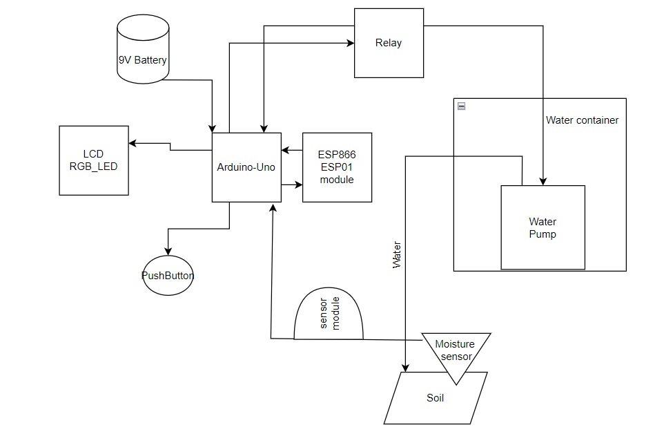

# Automatic-irrigation-system

  ### Introduction
  
Watering plants can be time-consuming and sometimes wasteful. An Automatic Irrigation System solves this problem by watering plants only when they need it. This project uses an Arduino to read data from a soil 
moisture sensor and control a water pump automatically.To make it more interactive, the system includes LEDs to show the status (e.g., dry, watering, or wet), buttons for manual controls, and an LCD to display real-time information like soil moisture levels and system status. This simple yet smart system saves water, helps plants stay healthy, and makes gardening easier and more efficient! 
     
  ### General description
The purpose of this project is the maintenance of a plant or a garden or even a crop, if we were to expand the project, using the arduino-uno microcontroller and its various peripherals.A sensor collects data from the ground, data based on which the microcontroller sends commands through a relay that activates a submersible pump. Through a hose, it pumps water to the ground until the sensor reads a certain level of humidity. This process is automatic but also manual by pressing a button and signaled by the presence of an LCD and an RGB LED.

  ### Hardware Design

#### Block scheme

#### Electric scheme

#### Components
  | **Component**                | **Source**                | **Specifications**                            |
|------------------------------|---------------------------|----------------------------------------------|
| Arduino Uno                  | LAB                       | Microcontroller board, ATmega328P            |
| Soil Moisture Sensor         | https://www.bitmi.ro      | Analog/Digital sensor, (0–1023 at 5V)        |
| Submersible water pump       | https://www.bitmi.ro      | DC water pump, 5-12V operating voltage ,1.6L/min|
| Relay Module (Low-Voltage Trigger) | https://www.bitmi.ro| 3-pin relay, supports low-voltage trigger control|
| 1602 LCD Module              | LAB                       | 16x2 character display,  5V                  |
| Potentiometer                | LAB                       | 10kΩ rotary potentiometer                    |
| RGB LED                      | LAB                       | Common cathode                               |
| Resistors                    | LAB                       | 220Ω - 1kΩ                                   |
| Push Button                  | LAB                       | Momentary switch for manual control          |
| Breadboard                   | LAB                       | Standard breadboard for prototyping          |
| Jumper Wires                 | LAB                       | Male-to-male and male-to-female connectors   |
| 9V Battery                   | Local electronics store   | 9V power supply                              |
| Barrel Jack Connector        | LAB                       | Battery - Arduino connector                  |
| ESP8266 ESP 01 module        | https://www.bitmi.ro      | 3.3V , 2.4GHz can conenct to Wi-fi           |
| Plastic hose                 | Local store               | The water is pumped through it               |

  

  ### Software Design

  ### Obtained results

  ### Journal

  ### Bibliography

