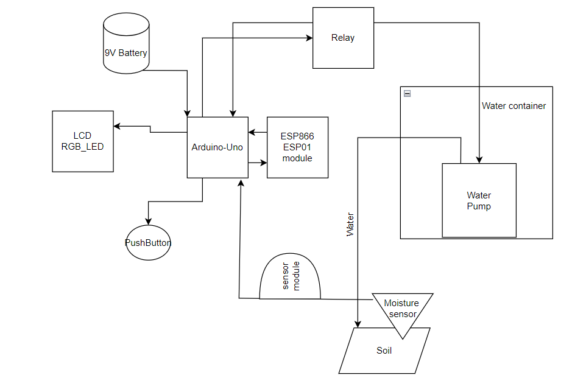
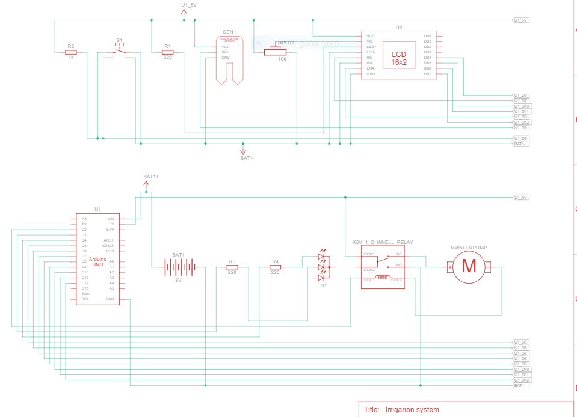
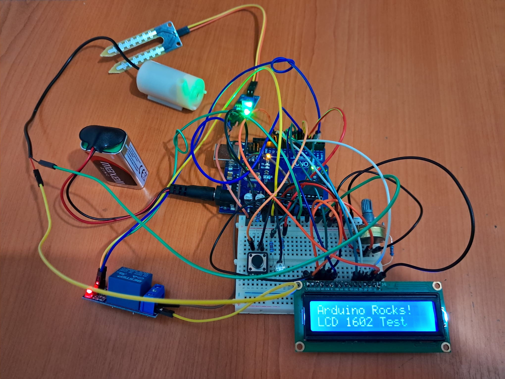

# Automatic-irrigation-system

  ### Introduction
  
Watering plants can be time-consuming and sometimes wasteful. An Automatic Irrigation System solves this problem by watering plants only when they need it. This project uses an Arduino to read data from a soil 
moisture sensor and control a water pump automatically.To make it more interactive, the system includes LEDs to show the status (e.g., dry, watering, or wet), buttons for manual controls, and an LCD to display real-time information like soil moisture levels and system status. This simple yet smart system saves water, helps plants stay healthy, and makes gardening easier and more efficient! 
     
  ### General description
The purpose of this project is the maintenance of a plant or a garden or even a crop, if we were to expand the project, using the arduino-uno microcontroller and its various peripherals.A sensor collects data from the ground, data based on which the microcontroller sends commands through a relay that activates a submersible pump. Through a hose, it pumps water to the ground until the sensor reads a certain level of humidity. This process is automatic but also manual by pressing a button and signaled by the presence of an LCD and an RGB LED.


  ### Hardware Design

  #### Block scheme
  

  #### Electric scheme
  

  #### Components
  | **Component**                | **Source**                | **Specifications**                            |
|------------------------------|---------------------------|----------------------------------------------|
| Arduino Uno                  | LAB                       | Microcontroller board, ATmega328P            |
| Soil Moisture Sensor         | https://www.bitmi.ro      | Analog/Digital sensor, (0–1023 at 5V)        |
| Submersible water pump       | https://www.bitmi.ro      | DC water pump, 5-12V operating voltage ,1.6L/min|
| Relay Module (Low-Voltage Trigger) | https://www.bitmi.ro| 3-pin relay, supports low-voltage trigger control|
| 1602 LCD Module              | LAB                       | 16x2 character display,  5V                  |
| Potentiometer                | LAB                       | 10kΩ rotary potentiometer                    |
| RGB LED                      | LAB                       | Common cathode                               |
| Resistors                    | LAB                       | 220Ω - 1kΩ                                   |
| Push Button                  | LAB                       | Momentary switch for manual control          |
| Breadboard                   | LAB                       | Standard breadboard for prototyping          |
| Jumper Wires                 | LAB                       | Male-to-male and male-to-female connectors   |
| 9V Battery                   | Local electronics store   | 9V power supply                              |
| Barrel Jack Connector        | LAB                       | Battery - Arduino connector                  |
| ESP8266 ESP 01 module        | https://www.bitmi.ro      | 3.3V , 2.4GHz can conenct to Wi-fi           |
| Plastic hose                 | Local store               | The water is pumped through it               |
  #### Partial Montage
  
  ####
  The hardware functionality of the automatic irrigation system involves multiple interconnected components to achieve an efficient and reliable setup. The core of the system is the Arduino UNO microcontroller, which serves as the central processing unit. The soil moisture sensor detects soil moisture levels and provides a digital output to pin 6 on the Arduino. The sensor works by measuring the resistance between its probes: when the soil is wet, conductivity increases and resistance decreases; when the soil is dry, conductivity drops, increasing resistance. The Arduino processes this data to determine if the soil moisture is below a defined threshold, triggering actions such as starting the DC water pump. To control the pump, a relay module is connected to pin 2. The relay's COM terminal is connected to the Arduino's VIN (9V battery supply), and the NO terminal connects to the pump’s positive terminal. This ensures the pump receives adequate power, as the Arduino's 5V pin may not be sufficient.

The system also includes a 1602 LCD display for real-time feedback, showing the current soil moisture level and system status. It communicates via parallel communication, with data lines (DB4–DB7) connected to Arduino pins 9–12, and control lines EN (pin 8) and RS (pin 7). A potentiometer is used to adjust the LCD contrast, while a 220-ohm resistor is added to the A+ pin to limit current and protect the backlight.

For system feedback, an RGB LED is used with two 220-ohm resistors for the red and green channels, which are connected to pins 4 and 3, respectively. The RGB LED visually indicates the system status: red when soil moisture is low, triggering the pump, and green when moisture levels are sufficient.

Additionally, a pushbutton with a pull-up resistor is connected to pin 5, allowing manual control or system override functionality.

Looking forward to the next project stage, the ESP8266 ESP-01 Wi-Fi module can be integrated to enable wireless communication. This will allow the system to transmit real-time data to a cloud server or mobile application, facilitating remote monitoring and control of the irrigation process. The ESP-01 module operates at 3.3V and communicates with the Arduino through serial communication (TX/RX pins), opening up the potential for smart IoT integration and advanced automation features.

This setup effectively combines sensors, actuators, and displays to create a smart, energy-efficient, and user-friendly irrigation system suitable for real-world gardening applications.
  
  #### Pin layout
  1.LCD Module (Parallel Communication):
  Pins 9, 10, 11, 12 (Arduino Digital Pins) → DB4, DB5, DB6, DB7 (LCD Data Pins):
  These pins are used for data communication between the Arduino and the LCD. 
  Pin 8 (Arduino Digital Pin) → EN (Enable Pin on LCD):
  The enable pin activates communication between the Arduino and LCD. 
  Pin 7 (Arduino Digital Pin) → RS (Register Select on LCD):
  The RS pin is used to switch between command and data modes.
  
  2.Soil Moisture Sensor:
  Pin 6 (Arduino Digital Pin) → D0 (Digital Output on Sensor):
  Pin 6 reads the digital output from the soil moisture sensor. The digital pin (D0) was chosen instead of analog (A0) because constant measurement is unnecessary. Instead, it triggers the water pump when soil      moisture drops below a threshold.
  
  3.Pushbutton (Manual Control):
  Pin 5 (Arduino Digital Pin) → Pushbutton:
  The button is connected with a pull-up resistor to ensure the pin reads HIGH by default and LOW when the button is pressed. 
  
  4.RGB LED (Status Indicator):
  Pin 4 (Arduino Digital Pin) → Red Pin on RGB LED:
  Indicates a warning state (e.g., dry soil).
  Pin 3 (Arduino Digital Pin) → Green Pin on RGB LED:
  Indicates a safe state (e.g., optimal soil moisture). 
  
  5.Relay Module (Pump Activation):
  Pin 2 (Arduino Digital Pin) → Relay Module Input:
  Pin 2 controls the relay, which switches the pump on or off based on the soil moisture sensor's reading.
  
  6.Relay Power Circuit:
  COM (Relay Common Terminal) → VIN (Arduino Input for External 9V Battery):
  The common terminal connects to the VIN pin, allowing the 9V battery to power the pump. The 9V battery ensures the pump receives sufficient power, as the Arduino’s 5V pin may not supply enough current.
  NO (Normally Open on Relay) → Pump Positive Terminal:
  The normally open (NO) terminal connects to the pump's positive terminal. This ensures the pump activates only when the relay closes (soil is dry).
  GND (Pump Ground Terminal) → GND (Arduino):
  The pump's ground wire connects to the Arduino's GND for a common reference.

  

  

  ### Software Design

  ```arduino
  #include <Arduino.h>
  #include <Wire.h>
  #include <LiquidCrystal.h>

  #define RELAY_PIN 2         
  #define SOIL_SENSOR_PIN A0  
  #define RED_LED_PIN 4       
  #define GREEN_LED_PIN 3     
  #define Start_btn 3
  
  LiquidCrystal lcd(7, 8, 9, 10, 11, 12); // (rs, enable, d4, d5, d6, d7)
  
  int water;                  
  unsigned long lastMeasureTime = 0;  
  const unsigned long measureInterval = 2000; // masor umiditatea la 2 sec
  
  unsigned long lastBlinkTime = 0;     // Timestamp for last blink
  const unsigned long blinkInterval = 500; // interval blink
  bool redLedState = false;            // Current state of the red LED
  
  void setup() {
      pinMode(RELAY_PIN, OUTPUT);
      pinMode(RED_LED_PIN, OUTPUT);
      pinMode(GREEN_LED_PIN, OUTPUT);
      pinMode(Start_btn, INPUT);
  
      Serial.begin(9600);
      Serial.println("Soil Moisture Sensor");
  
      lcd.begin(16, 2); 
      lcd.print("Moisture: ----"); 
  }
  
  void loop() {
      unsigned long currentTime = millis(); // Get the current time
  
      if (currentTime - lastMeasureTime >= measureInterval) {
          lastMeasureTime = currentTime; // Update la timp
  
          water = analogRead(SOIL_SENSOR_PIN);
  
          Serial.print("Soil Moisture Value: ");
          Serial.println(water);
  
          lcd.setCursor(0, 0); 
          lcd.print("Moisture: ");
          lcd.print(water);   
          lcd.print("    ");   
      }
  
      if (water > 500) { 
          digitalWrite(RELAY_PIN, LOW);       
          digitalWrite(GREEN_LED_PIN, LOW); 
          if (currentTime - lastBlinkTime >= blinkInterval) {
              lastBlinkTime = currentTime;         
              redLedState = !redLedState;           // toggle la ledul rosu
              digitalWrite(RED_LED_PIN, redLedState); 
          }   
          lcd.setCursor(0, 1); 
          lcd.print("Status: Dry     "); 
      } else { 
          digitalWrite(RELAY_PIN, HIGH);     
          digitalWrite(GREEN_LED_PIN, HIGH);  
          digitalWrite(RED_LED_PIN , LOW);
          lcd.setCursor(0, 1); 
          lcd.print("Status: Humid "); 
      }
  } ```

  The LiquidCrystal library was chosen for this project because it provides a straightforward way to control character LCD displays, such as the commonly used 16x2 or 20x4 models. These displays are often based on the Hitachi HD44780 driver, and the library simplifies the process of initializing the display, printing text, and managing cursor positions. Using this library eliminates the need to write low-level code to handle timing, communication, and control commands for the LCD, allowing the focus to remain on building project functionality. In this project, the LCD plays a critical role in providing real-time feedback by displaying soil moisture levels and the system's status (e.g., "Moisture: X," "Status: Dry"). The LiquidCrystal library's flexibility and ease of use make it an ideal choice for implementing this vital feature.
  

The project is built around a soil moisture monitoring system, integrating a moisture sensor, a relay for irrigation control, an LCD for visual feedback, and LEDs for quick status indication. The code is organized into two main functions: setup, where all components are initialized, and loop, where the system logic runs. In the loop, the moisture sensor periodically measures soil moisture, and the readings are displayed on the LCD. If the moisture level drops below a threshold, the relay activates irrigation, and a blinking red LED signals dryness. Otherwise, a green LED indicates optimal conditions, and the relay remains off.

Validation was performed iteratively. The moisture sensor was calibrated with soil samples of varying humidity, and the LCD output was checked for accuracy. The relay and LEDs were tested under simulated conditions to ensure they responded appropriately to dry and humid states. This step-by-step approach confirmed that all components interact correctly and meet the project’s requirements.

The soil moisture sensor provides an analog output value that ranges from 0 to approximately 1000 (or potentially up to 1100, depending on the sensor's exact model and environmental factors). This value corresponds to the soil's moisture level, with lower values indicating wetter soil and higher values indicating dryness. To calibrate the sensor, I tested it in controlled conditions by inserting it into dry soil, moist soil, and fully saturated soil to observe the range of output values. These tests helped identify thresholds, such as the dryness level at which irrigation needs to activate (e.g., above 500).

The sensor measures moisture by detecting changes in the electrical conductivity of the soil. Wet soil conducts electricity better, resulting in lower resistance and, thus, lower sensor values. Conversely, dry soil has higher resistance, leading to higher values. This principle forms the basis for interpreting the sensor readings.

A delay of 2 seconds between measurements is implemented to allow the sensor to stabilize and to reduce noise or fluctuations in the readings. This interval ensures more reliable data without continuously polling the sensor, which could lead to unnecessary power consumption and potential overheating. This periodic measurement balances accuracy with efficiency, ensuring the system operates optimally.
  ### Obtained results

  Video : https://youtube.com/shorts/HPF-jjIN3U0


  ### Bibliography
 https://www.arduino.cc/reference/en
 https://www.arduino.cc/en/Reference/LiquidCrystal
 https://forum.arduino.cc
